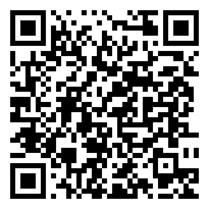

# Redirect Guard

指定したアプリ(監視対象アプリ)を使用中に、ユーザーの操作なしに他のアプリ(Google Play、ブラウザ、外部アプリ等)へ自動的に画面遷移が発生した場合、それを検知して即座に監視対象アプリへ強制的に戻す Android アプリです。

広告 SDK(Pangle、Fyber、Meta Audience Network 等)による、悪質な自動リダイレクト(広告視聴後や表示中に、ユーザーが何も操作していないのに勝手に Google Play や外部サイトへ飛ばされる挙動)を無効化することを主な目的としています。

## インストール

以下の QR コードから最新版の APK をダウンロードできます([Releases](https://github.com/Waka-P/Redirect-Guard/releases/latest) にも同じものがあります)。

<p align="center">
  
</p>

Google Play 経由の配布ではないため、インストール時に「提供元不明のアプリ」の警告が表示されます。内容を理解した上でインストールしてください。

## なぜ「アクセシビリティ」権限が必要なのか

このアプリは以下の目的のみに Accessibility Service を使用します。

- 前面アプリの切り替わり(`packageName` の変化)を検知する
- ユーザーの直近の操作(タップ・スワイプ)の有無を判定する
- 「自動遷移」と判断した場合に、監視対象アプリへ戻す操作(戻る/再起動)を行う

**画面内容の読み取りはデフォルトでは一切行いません**(`canRetrieveWindowContent` は本来 false が望ましいですが、後述の「広告の自動クローズ/自動スキップ」機能を使うために true にしています。ただしこれらの機能自体は設定でデフォルトOFFになっており、ユーザーが明示的に有効化した場合のみ、広告の「閉じる」「スキップ」ボタンのラベル/IDを読み取ります)。

取得した情報を外部に送信することはありません。すべてローカル(端末内)で完結します。

## 主な機能

- 複数の監視対象アプリを選択して同時に監視
- 自動遷移の検知 → 元のアプリへの強制復帰(`GLOBAL_ACTION_BACK` + フェイルセーフの再起動)
- 許可リスト(ホームランチャー、通知シェード、電話アプリ等は自動的に除外)
- 広告の「閉じる」ボタン自動タップ(任意・実験的)
- 広告の「スキップ」ボタン自動タップ(任意・実験的、キーワード一致 + 位置ベースの推定)
- 検知ログ(日時・遷移先・判定時の経過時間・誤検知フラグ)
- テーマ(背景色 × アクセントカラーの組み合わせを10種類から選択可能)

## 既知の制約・リスク

- 監視対象アプリの WebView 内部で完結する遷移(外部アプリの起動を伴わないもの)は検知できません。OS レベルでアプリ切り替え(`packageName` の変化)が発生するケースのみ対応可能です。
- 広告の閉じる/スキップボタンが Canvas 描画等で Accessibility ノードとして存在しない場合、自動タップはできません(その場合も、実際に自動遷移が発生すれば検知・復帰機能は引き続き働きます)。
- 広告 SDK のクラス名パターンに依存するため、未知の SDK では自動タップが効かないことがあります。`app/src/main/java/.../data/SettingsRepository.kt` の `defaultAdWindowPatterns()` にパターンを追加することで対応できます。
- タスクスタックの構成によっては `GLOBAL_ACTION_BACK` で意図通りに戻らない場合があります(その場合は再起動のフェイルセーフが働きます)。
- iOS は対象外です(Accessibility API の制約により実装不可)。

## ビルド方法

Android SDK と JDK 17 以上が必要です。

```bash
./gradlew assembleDebug
```

生成された APK は `app/build/outputs/apk/debug/app-debug.apk` に出力されます。

### リリースビルド(配布用)

配布用 APK には署名が必要です。

1. `keystore.properties.example` を `keystore.properties` にリネームし、署名鍵の情報を入力する(このファイルは `.gitignore` 済みでコミットされません)
2. 署名鍵をまだ持っていない場合は作成する:
   ```bash
   keytool -genkey -v -keystore release.jks -keyalg RSA -keysize 2048 -validity 10000 -alias redirectguard
   ```
3. リリースビルドを実行する:
   ```bash
   ./gradlew assembleRelease
   ```
   `app/build/outputs/apk/release/app-release.apk` が生成されます(minify/リソース圧縮が有効)。GitHub Releases にアップロードする際は `RedirectGuard.apk` にリネームしてください。

`keystore.properties` が無い状態で `assembleRelease` を実行した場合は debug 鍵で署名されます(**配布には使わないでください**)。

## 配布形態

Google Play のポリシー上、Accessibility 権限の使用目的次第では審査に通らない可能性が高いため、サイドロード配布(GitHub Releases)を前提としています。

新しいバージョンをリリースする際は、GitHub Releases にアップロードする APK ファイル名を **`RedirectGuard.apk`** に統一してください。README の QR コード / ダウンロードリンクは `.../releases/latest/download/RedirectGuard.apk` という固定URLを指しているため、この名前を守ることで QR コードを毎回作り直す必要がなくなります。

## 使い方

1. アプリを起動し、「アクセシビリティ設定」ボタンから Accessibility Service を有効化する
2. 「監視対象アプリの選択」から監視したいアプリを選ぶ(複数選択可)
3. 「監視 ON/OFF」をONにする
4. 必要に応じて「広告の自動クローズ」「広告のスキップ自動タップ」を有効化する

監視中は常駐通知が表示されます。通知から「監視を一時停止」も可能です。
